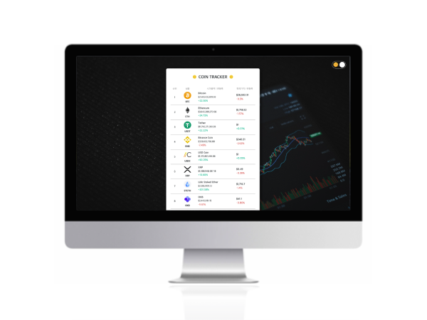
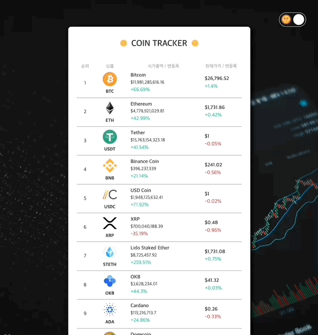
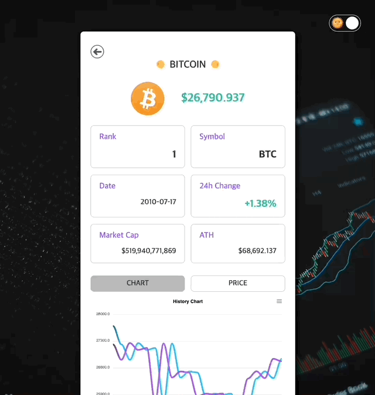
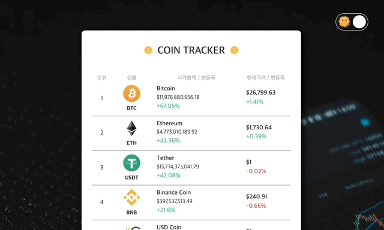

# Coin Tracker
 

 
<a display="block" href="#">https://github.com/KimByul1225/coin_tracker</a>
  

 

## 화면구성

 

## Stacks
### Environment

### Config
        
### Development
 

![Recoil](https://img.shields.io/badge/recoil-3578e5?style=for-the-badge&logo=data:image/svg+xml;base64,PHN2ZyB4bWxucz0iaHR0cDovL3d3dy53My5vcmcvMjAwMC9zdmciIHdpZHRoPSI2MDAiIGhlaWdodD0iNjAwIiB2aWV3Qm94PSIwIDAgNjAwIDYwMCI+PGxpbmsgeG1sbnM9IiIgdHlwZT0idGV4dC9jc3MiIGlkPSJkYXJrLW1vZGUiIHJlbD0ic3R5bGVzaGVldCIgaHJlZj0iIi8+PGcgZmlsbD0id2hpdGUiPjxwYXRoIGQ9Ik0xNDIuNTM2IDE5OC44NThjMCAyNi4zNi0yMS4zNjggNDcuNzItNDcuNzIgNDcuNzItMjYuMzYgMC00Ny43MjItMjEuMzYtNDcuNzIyLTQ3LjcyczIxLjM2LTQ3LjcyIDQ3LjcyLTQ3LjcyYzI2LjM1NSAwIDQ3LjcyMiAyMS4zNiA0Ny43MjIgNDcuNzIiLz48cGF0aCBkPSJNNTA1LjE4IDQxNC4yMjVIMjM4LjEyNGMtMzUuMjUgMC02My45MjYtMjguNjc0LTYzLjkyNi02My45MjNzMjguNjc4LTYzLjkyNiA2My45MjYtNjMuOTI2aDEyMC43OGMyMC44MTYgMCAzNy43NTMtMTYuOTM4IDM3Ljc1My0zNy43NTZzLTE2LjkzOC0zNy43NTYtMzcuNzUzLTM3Ljc1Nkg5NC44MWMtNy4yMjcgMC0xMy4wODYtNS44Ni0xMy4wODYtMTMuMDg1IDAtNy4yMjcgNS44Ni0xMy4wODYgMTMuMDg1LTEzLjA4NmgyNjQuMDkzYzM1LjI1IDAgNjMuOTIzIDI4LjY3OCA2My45MjMgNjMuOTI2cy0yOC42NzQgNjMuOTIzLTYzLjkyMyA2My45MjNoLTEyMC43OGMtMjAuODIgMC0zNy43NTYgMTYuOTM4LTM3Ljc1NiAzNy43NiAwIDIwLjgxNiAxNi45MzggMzcuNzUzIDM3Ljc1NiAzNy43NTNINTA1LjE4YzcuMjI3IDAgMTMuMDg2IDUuODYgMTMuMDg2IDEzLjA4NSAwIDcuMjI2LTUuODU4IDEzLjA4NS0xMy4wODUgMTMuMDg1eiIvPjxwYXRoIGQ9Ik00NTcuNDY0IDQwMS4xNDJjMC0yNi4zNiAyMS4zNi00Ny43MiA0Ny43Mi00Ny43MnM0Ny43MiAyMS4zNiA0Ny43MiA0Ny43Mi0yMS4zNiA0Ny43Mi00Ny43MiA0Ny43Mi00Ny43Mi0yMS4zNi00Ny43Mi00Ny43MiIvPjwvZz48c3R5bGUgeG1sbnM9IiIgaWQ9ImRhcmstbW9kZS1jdXN0b20tY29sb3IiPgoJCTpyb290ewoJCQktLWJnLWNvbG9yOnJnYmEoMjYsMjYsMjYsMSk7CgkJCS0tdGV4dC1jb2xvcjpyZ2JhKDExMCwxMTAsMTEwLDEpOwoJCQktLWEtY29sb3I6cmdiYSg5MCwxMjAsMTIwLDEpOwoJCQktLWEtdmlzaXRlZC1jb2xvcjpyZ2JhKDEyMCwxMjAsOTAsMSk7CgkJCS0tYS1ob3Zlci1jb2xvcjpyZ2JhKDIxMSwyMTEsMjExLDEpOwoJCQktLWlucHV0LWJvcmRlci1jb2xvcjpyZ2JhKDIxMSwyMTEsMjExLDAuMik7CgkJCS0taW5wdXQtcGxhY2Vob2xkZXItY29sb3I6cmdiYSgxNzMsMjE2LDIzMCwxKTsKCQkJLS1kaWFsb2ctYmctY29sb3I6cmdiYSgzNiwzNiwzNiwwLjk1KTsKCQkJLS1iZy1pbWFnZTpsaW5lYXItZ3JhZGllbnQocmdiYSgyNiwyNiwyNiwxKSxyZ2JhKDI2LDI2LDI2LDEpKTsKCQl9Cgk8L3N0eWxlPjwvc3ZnPg==)
 
### Style
 

### Configuration Management & Deploy

    
 

## Project Detail
### 1. 가상화폐 정보 제공
- React Query를 이용한 가상화폐 API연동.

 

### 2. 데이터 시각화
- Apex Charts를 이용한 데이터 시각화.

 

### 3. 라이트 모드, 다크모드 구현
- Styled Components와 Recoil을 활용 라이트 모드, 다크모드 구현.

 

